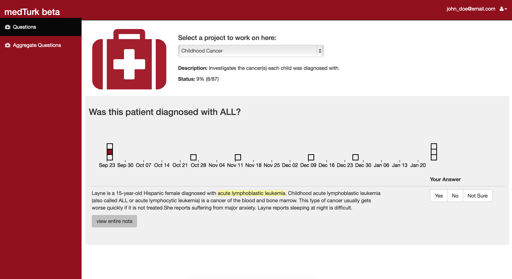
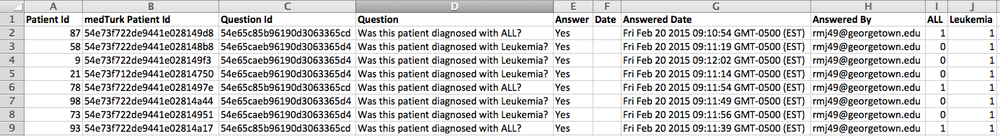

medTurk
=======

medTurk (inspired by Amazon's Mechanical Turk) supports clinical research by using the ingenuity of humans to convert unstructured clinical notes into structured information.

### What it is?
It's software (*i.e., a web application*) you host privately. It allows multiple curators to answer questions in parallel on clinical notes analogous to the way Amazon Mechanical Turk operates. Their answers are then downloadable in CSV for analysis in your favorite analysis software (e.g., Python, R, Excel).

### Can you give me a quick example?
Suppose you have a set of clinical notes for childhood cancer survivors and among many things, you are interested in each child's cancer diagnosis. After uploading this set of clinical notes into medTurk, you can create a questionnaire that contains questions such as, **Was this patient diagnosed with ALL?** . You then assign allowable answer choices such as **Yes**, **No**, and **Not Sure**. In addition, you must assign keywords such as **ALL** and **acute lymphoblastic leukemia**. medTurk uses these keywords to locate passages of text that are probably relevant to answering the question. After you have assigned curators for this particular application, a curator can login and be presented with a question such as shown below:

The curator may then view all relevant passages of text over time (specific to a particular patient) to determine the answer to this question. Each curator is presented with a different question. The **status** field in this screenshot indicates how many more questions must be answered (in this case, 8 of 87 have been answered).

At any time, an admin of medTurk may download answered data in CSV and obtains a file such as below:

Ready to get started?
=======

Please visit our [wiki page](https://github.com/ICBI/medturk/wiki) to get started.