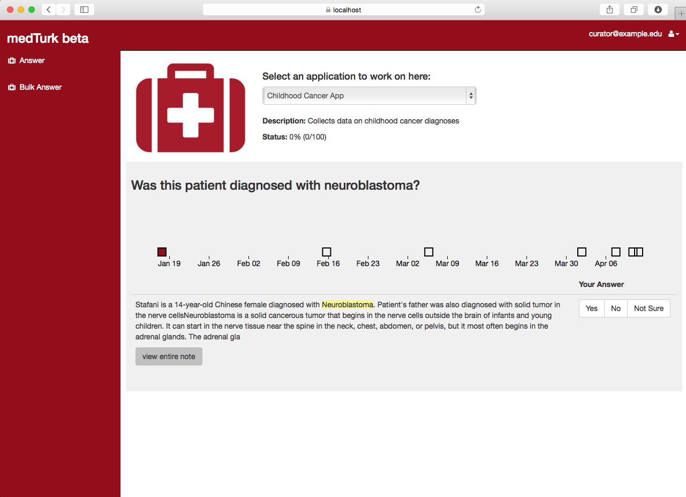
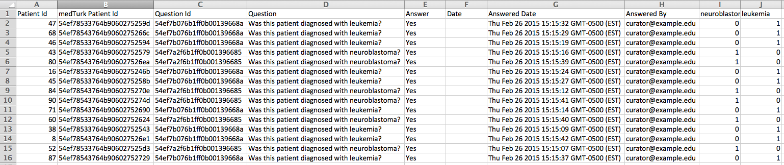

medTurk
=======

medTurk (inspired by Amazon's Mechanical Turk) supports clinical research by using the ingenuity of humans to extract information from unstructured clinical notes.

### What it is?
It's software (*i.e., a web server*) you host privately. It lets curators answer questions in parallel analogous to the way Amazon Mechanical Turk operates. The answers are then downloadable in CSV for analysis using your favorite software (e.g., R, Excel).

### Can you give me a quick example?
Suppose you have clinical notes for cancer survivors and you are interested in every patient's cancer diagnosis. medTurk permits the creation of a *questionnaire* that contains questions such as: **Was this patient diagnosed with leukemia?** or **Was this patient diagnosed with neuroblastoma?** . You may then assign answer choices such as **Yes**, **No**, and **Not Sure**. Lastly, you assign keywords such as **neuroblastoma**, **ALL**, or **leukemia**. medTurk uses these keywords to locate passages of text that are probably relevant to answering the question. After curators are assigned for this particular application, a curator may login and be presented with a question as shown below:

A curator may view all relevant passages of text over time (all specific to a particular patient) to answer the question. Upon answering, the curator is randomly presented with another question. The **status** field in this screenshot indicates how many more questions must be answered (in this case, 0 of 100 have been answered). 

At any time, an admin of medTurk may download answered data in CSV and obtain a file such as shown below:

### Quick highlights of medTurk

* Questionnaires are shareable: once they're created, they are downloadable and shareable with others
* Answered data can be downloaded in [EventFlow](http://www.cs.umd.edu/hcil/eventflow/) format
* Standardizes the process of data collection
* If a patient lacks keywords in their notes relevant to the question, that question will not be generated for that patient
* A question can be answered for many patients at once in *Bulk Answer* mode

Ready to get started?
=======

Please visit our [wiki page](https://github.com/ICBI/medturk/wiki) to get started.