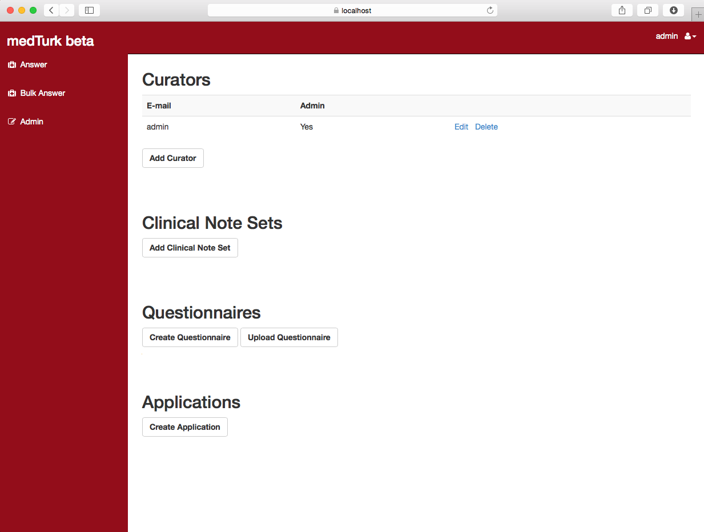

medturk
=======

medTurk (inspired by Amazon's Mechanical Turk) supports clinical research by using the ingenuity of humans to convert unstructured clinical notes into structured data

Ready to get started? Our [medTurk book](book/medturk.pdf) provides everything you want to know.
